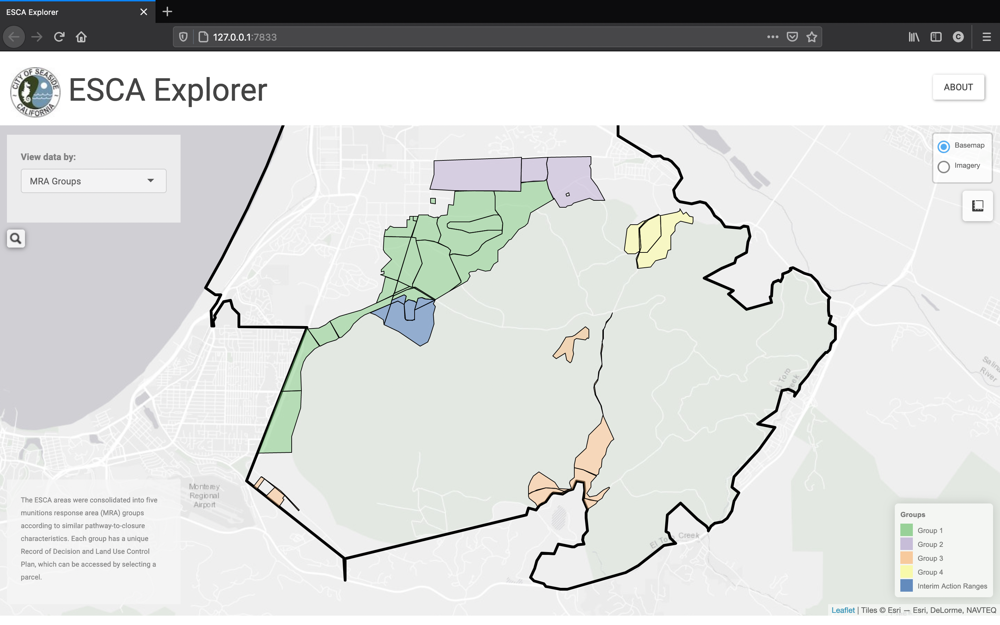

`{escaexplorer}`
================

-   [Installation](#installation)
-   [Launching App](#launching-app)

<!-- badges: start -->

[](https://travis-ci.com/cjcallag/escaexplorer)
[](https://www.r-project.org/)
[](https://www.mit.edu/~amini/LICENSE.md)
<!-- badges: end -->

**{escaexplorer}** is a repository for the ESCA Explorer application
developed for the City of Seaside Environmental Services Cooperative
Agreement.

## Installation

The R installation can be accomplished using **{remotes}**:

``` r
if(!requireNamespace("remotes")) install.packages("remotes")

remotes::install_github("cjcallag/escaexplorer")
```

## Launching App

Launching can be done programmatically like so:

``` r
escaexplorer::launch_app(app = "explorer",
                         use_browser = TRUE)
```


